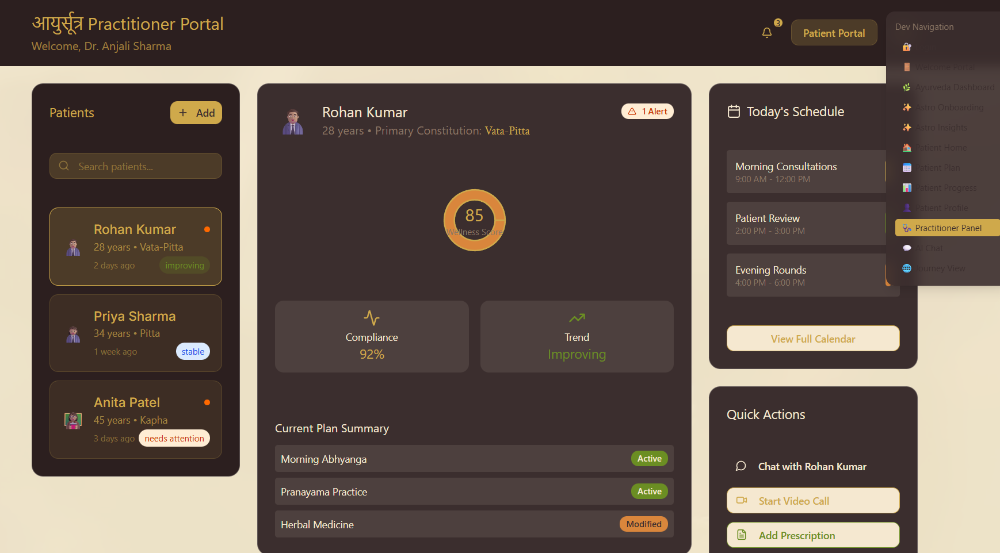
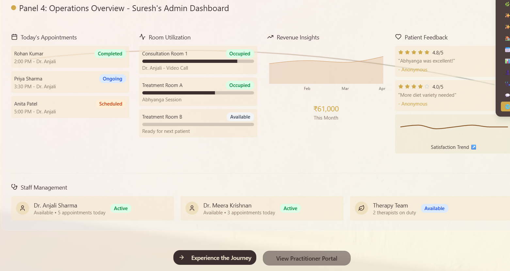

🌿 Arogya-AI — AI-powered Ayurvedic Insight System

Arogya-AI blends modern medical data with Ayurveda, Yogic science, and astrology to help users understand their mind–body health and assist Ayurvedacharyas in delivering faster, more accurate consultations.

This project was built for an Agentic AI Hackathon and showcases a four-agent architecture designed to make preventive healthcare personalized, actionable, and easy to understand.

---

##  Core User Problems

### 1. Lack of Self-Understanding  
Most people don’t know their:
- dosha (body type)  
- agni (digestive/metabolic strength)  
- ama (toxicity/load)  
- emotional tendencies  
- natural constitution (swabhav)

They feel lost about how these influence digestion, energy, mood, and daily performance.

### 2. No Daily Actionable Guidance  
Even if they know their dosha, they don’t know:
- what to eat today  
- what lifestyle to follow in the current season (ritu)  
- how to adjust based on sleep, stress, or weather  
- how to apply holistic advice in a busy urban life  

### 3. Scattered & Conflicting Information  
Advice from family, YouTube, Instagram, or home remedies is overwhelming and contradictory.  
Nothing is personalized, structured, or medically aligned. 

---

## 🎯 Our Core Goal

Make Ayurvedic preventive healthcare:
- Easy to understand  
- Personalized  
- Actionable  
- Doctor-friendly  

This increases user clarity while improving the efficiency and accuracy of Ayurvedic consultations.

---

## 🧑‍🤝‍🧑 Target Users

- Working professionals (28–45)  
- Long-term allopathy users who want holistic, side-effect-free guidance  

---

## ⚙️ Core Agentic Engines

Arogya-AI is powered by four specialized AI agents that work together to create a unified, personalized Ayurvedic insight system. Each agent handles a distinct intelligence layer—medical, dietary, astrological, and Ayurvedic—resulting in a complete mind–body assessment for users and a clarity-boosting dashboard for Ayurvedacharyas.

---

###  1. This agent extracts, interprets, and summarizes modern medical data from user-uploaded reports.

**Capabilities**
- Parses PDFs/images to identify biomarkers, symptoms, and risk indicators  
- Generates structured health summaries for doctors  
- Maps medical markers to Ayurvedic concepts (agni, ama, dosha aggravation)  
- Flags red-zones requiring immediate medical attention  

This acts as the bridge between allopathy diagnostics and Ayurvedic interpretation.

---

###  2. Diet Intelligence Engine  
This agent turns Ayurvedic principles into real-world, actionable diet plans.

**Capabilities**
- Creates daily and seasonal meal recommendations  
- Considers dosha, agni, weather, and stress levels  
- Adds triage suggestions: home remedies vs. herbal therapy vs. medical escalation  
- Avoids conflicting foods (viruddha ahara) and optimizes digestion  

Users receive practical food guidance, not vague generic tips.

---

###  3. Astrology Rhythm Agent  
A modern, non-superstitious approach to astrological timing for holistic health.

**Capabilities**
- Tracks lunar days (tithi), planetary positions, emotional cycles  
- Maps astrological rhythm with circadian rhythm and Ayurvedic routine  
- Suggests best times for meditation, cleansing, heavy work, or rest  
- Predicts mental clarity cycles and mood fluctuations  

This agent operationalizes astrology as a practical health-timing system.

---

###  4. Core Ayurvedacharya Engine  
This engine evaluates a user’s constitution and produces personalized Ayurvedic insights.

**Capabilities**
- Determines prakriti (body type) and vikriti (current imbalance)  
- Interprets digestion quality, sleep cycles, stress patterns, and energy flow  
- Generates lifestyle recommendations for current season (ritu)  
- Provides daily ayurvedic adjustments based on user inputs and medical data  

This is the “core intelligence system” behind personalized Ayurvedic guidance.

---

## 🔗 Why These Agents Matter

Together, these four engines create an end-to-end wellness intelligence system:

- Medical science → Ayurveda → Diet → Astro-circadian timing  
- Personalized insights instead of generic lists  
- Seamless understanding for Ayurvedacharyas during consultations  
- A preventive health model designed for modern users  

This multi-agent architecture turns Arogya-AI into a unique preventive-health platform that blends evidence, tradition, and daily usability.

##  Tech Stack

- **Frontend:** React.js , Nextjs, Shadcn 
- **Backend:** n8n (automations & workflows)  
- **AI / NLP:** OpenAI API  
- **Storage:** Cloud storage / neon db (postgress SQL)

---

##  Arogya-AI: Why This App Matters

Arogya-AI unifies Ayurveda, modern medical reports, circadian rhythm science, and practical astrology into one organized insight system.  
It empowers users with clear understanding, daily routines, and personalized guidance while helping Ayurvedacharyas conduct faster, deeper, and more accurate consultations.

## 📸 Screenshots

### Home Screen 
### Report Upload  
### Discover you Ayurvedic type 

