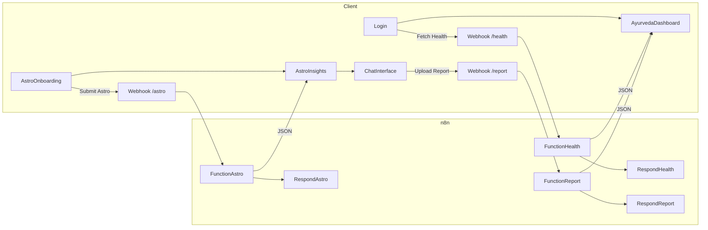

# Ayurvedic AI Platform – Hackathon Edition

An end-to-end prototype that blends Ayurveda, astrology-derived insights, and AI guidance. It includes a compact dashboard, an astrology onboarding flow, a landing page with human-centric insights, and an AI chat with report upload that integrates n8n webhooks.

## Quick Start

1. `npm i`
2. `npm run dev`
3. Open `http://localhost:3000/`
4. Use Dev Navigation (top-right) to jump to:
   - 🔐 Login
   - 🌿 Ayurveda Dashboard
   - ✨ Astro Onboarding
   - ✨ Astro Insights
   - 💬 AI Chat

## Screens & Flow

- Login → fetches health data from `http://localhost:5678/webhook-test/health` and opens Ayurveda Dashboard
- Astro Onboarding → posts to `http://localhost:5678/webhook-test/astro`, stores `astro-insights`, routes to Astro Insights
- Astro Insights → greets and displays current state, dosha distribution, human interpretation
- AI Chat → supports normal chat plus “Upload Report”, which posts file to `http://localhost:5678/webhook-test/report` and updates the dashboard data

## Features

- Ayurveda Dashboard with compact charts:
  - Digestive Strength radial gauge
  - Dosha Balance pie + legend
  - Energy Curve line chart
  - Detailed diet guidance (prefer/avoid qualities, recommended foods)
  - Seasonal/location/work-nature insights
- Astrology-driven Onboarding and Insights
- AI Chat with report upload and data refresh
- n8n flows for health, report, and astrology integration

## Project Structure

- `src/App.tsx` – screen router and Dev Navigation
- `src/components/Login.tsx` – login + health webhook
- `src/components/AyurvedaDashboard.tsx` – main dashboard
- `src/components/AstroOnboarding.tsx` – astrology onboarding form
- `src/components/AstroInsights.tsx` – astrology landing page
- `src/components/ChatInterface.tsx` – AI chat + report upload
- `docs/n8n/*.json` – importable n8n flows
- `docs/screenshots/` – add your screenshots here

## n8n Integration

Import the JSON flows from `docs/n8n` into your n8n instance.

- Health: GET `/webhook-test/health` → returns JSON for the dashboard (`localStorage['ayurveda-dashboard']`)
- Report: POST `/webhook-test/report` → accepts `report_file`, returns combined insights
- Astro: POST `/webhook-test/astro` → accepts onboarding payload, returns `astro-insights`

## Diagrams



## API Contracts

### Health JSON

Top-level keys like `snapshot`, `doshaProfile`, `metabolicDigestive`, `foodCompatibility` (with `prefer_qualities`, `avoid_qualities`, `recommended_foods`, etc.), and `extras` (`balanceMeter`, `climateEffectScore`, `foodScore`, `energyCurve`).

### Report JSON

Same shape as Health JSON; merges uploaded report-derived fields into dashboard-ready output.

### Astro JSON

Keys like `greeting`, `personaTitle`, `characterSummary`, `currentState`, `doshaDistribution`, `interpretation`, `natureInsights` used by Astro Insights.

## Screenshots

Place screenshots under `docs/screenshots/` and reference them here in Markdown.

## Deployment & Git Upload

Initialize repository and push to GitHub:

```bash
git init
git add .
git commit -m "Hackathon: Ayurveda + Astrology + AI Platform"
git branch -M main
git remote add origin https://github.com/vincentdkafka/A-team.git
git push -u origin main
```

If using a token, set the remote as:

```bash
git remote set-url origin https://<TOKEN>@github.com/vincentdkafka/A-team.git
```

## Hackathon Notes

- Keep flows simple and observable; start with static JSON and iterate
- Snapshot meaningful metrics, then add richer interpretations
- Ensure graceful fallbacks when webhooks are offline
